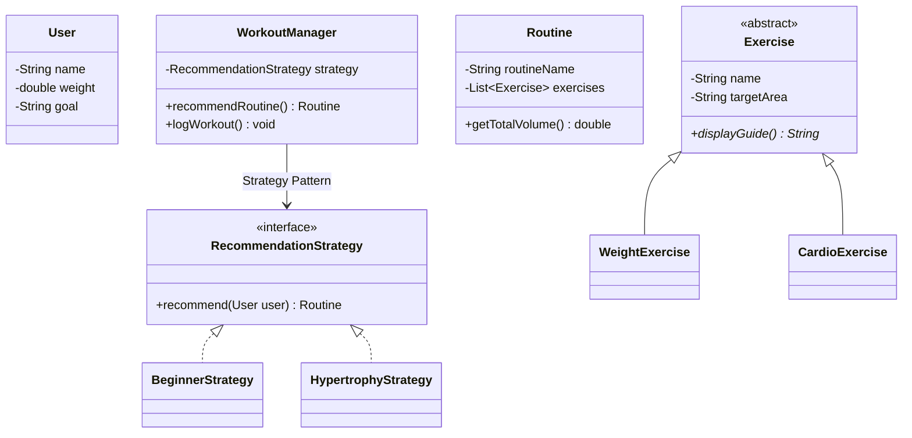

# OSS Fitness Tracker 🏋️‍♂️

[](https://opensource.org/licenses/MIT)
[](https://www.oracle.com/java/technologies/downloads/)
[](https://maven.apache.org/)

**OSS Fitness Tracker**는 입문자의 운동 진입 장벽을 낮추고, 데이터 기반의 체계적인 성장을 돕는 오픈소스 피트니스 솔루션입니다. 객체지향 설계 원칙(SOLID)과 클린 아키텍처를 준수하여 높은 확장성을 제공합니다.

---

## 📖 목차
1. [요구사항 분석](#-요구사항-분석)
2. [핵심 기능](#-핵심-기능)
3. [시스템 설계 (UML)](#-시스템-설계-uml)
4. [기술 스택](#-기술-스택)
5. [시작하기](#-시작하기)
6. [로드맵 (MVP)](#-로드맵-mvp)
7. [기여 방법](#-기여-방법-contributing)
8. [라이선스](#-라이선스-license)

---

## 📋 요구사항 분석 (Requirement Analysis)

본 프로젝트는 다음과 같은 페르소나의 문제를 해결하기 위해 설계되었습니다.

| 페르소나 | 문제 상황 (Pain Points) | 솔루션 (OSS Approach) |
| :--- | :--- | :--- |
| **헬린이 (입문자)** | 무엇부터 할지 모름, 기구 사용법 미숙 | 레벨/기구 기반 시작 가이드 및 루틴 추천 |
| **루틴 미아** | 매일 똑같은 루틴에 매너리즘 | 타겟 부위/목적별 루틴 템플릿 및 커스텀 기능 |
| **다이어터** | 체중 변화보다 눈바디/체성분 관리 | 목표 달성률 시각화 및 운동 볼륨 트래킹 |

---

## ✨ 핵심 기능

- **개인화 온보딩**: 사용자의 수준(입문/중급/고급)과 보유 기구에 따른 환경 최적화.
- **전략 기반 루틴 추천**: `Strategy Pattern`을 활용하여 근비대, 다이어트 등 목적별 맞춤 루틴 제공.
- **커스텀 루틴 디자이너**: 운동 라이브러리에서 직접 종목을 선택하여 나만의 운동 계획 수립.
- **데이터 지속성**: `Repository Pattern`을 통해 로컬 환경에 사용자 데이터 및 기록 보존.

---

## 🏗 시스템 설계 (UML)

### 클래스 다이어그램 (Class Diagram)



---

## 🛠 기술 스택

- **Core**: Java 17
- **UI**: JavaFX (with Modern CSS)
- **Build**: Maven
- **Architecture**: Clean Architecture (Presentation - Application - Domain - Infrastructure)

---

## 🚀 시작하기

### 설치 및 실행
```bash
# 저장소 복제
git clone https://github.com/dlwlssud123/OSS_design_pre.git

# 프로젝트 폴더 이동
cd OSS_design_pre/fitness-app

# 빌드 및 실행
mvn clean compile javafx:run
```

---

## 🗺 로드맵 (MVP)

- [x] **MVP (Must)**: 사용자 온보딩, 기본 운동 루틴 추천, 커스텀 루틴 생성, 파일 저장.
- [ ] **V2 (Should)**: 운동 성과 시각화 그래프, 부위별 볼륨 통계, 배지 시스템.
- [ ] **V3 (Could)**: AI 기반 운동 추천 고도화, 유투브 연동 운동 가이드, 식단 기록 추가.

---

## 🤝 기여 방법 (Contributing)

오픈소스 기여를 환영합니다! 아래 절차를 따라주세요.

1. 이 저장소를 **Fork** 합니다.
2. 새로운 **Branch**를 생성합니다 (`git checkout -b feature/AmazingFeature`).
3. 변경 사항을 **Commit** 합니다 (`git commit -m 'Add some AmazingFeature'`).
4. Branch에 **Push** 합니다 (`git push origin feature/AmazingFeature`).
5. **Pull Request**를 생성합니다.

---

## 📄 라이선스 (License)

본 프로젝트는 **MIT License**를 따릅니다. 자세한 내용은 [LICENSE](LICENSE) 파일을 참조하세요.

---
*Developed as part of the Open Source Software Design Course.*
