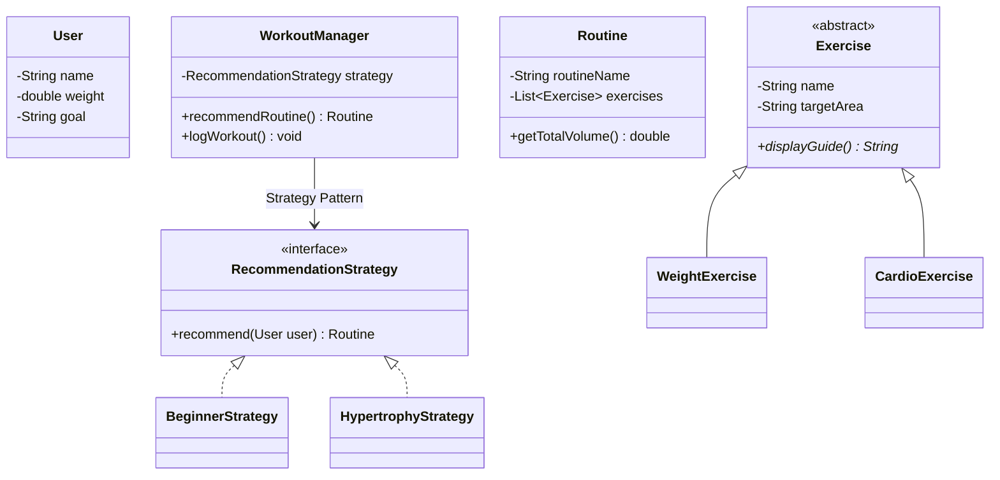

# OSS Fitness Tracker 🏋️‍♂️

[](https://opensource.org/licenses/MIT)
[](https://www.oracle.com/java/technologies/downloads/)
[](https://maven.apache.org/)

> **Language: [English](#english) | [한국어](#한국어)**

---

## English

**OSS Fitness Tracker** is an open-source fitness solution designed to lower the barrier for beginners and foster data-driven growth. It adheres to Object-Oriented Design principles (SOLID) and Clean Architecture for high extensibility.

### 📖 Table of Contents
1. [Requirement Analysis](#-requirement-analysis)
2. [Core Features](#-core-features)
3. [System Design (UML)](#-system-design-uml)
4. [Tech Stack](#-tech-stack)
5. [Getting Started](#-getting-started)
6. [Roadmap (MVP)](#-roadmap-mvp)
7. [Contributing](#-contributing)
8. [License](#-license)

### 📋 Requirement Analysis

This project solves problems for the following personas:

| Persona | Problem (Pain Points) | OSS Approach (Solution) |
| :--- | :--- | :--- |
| **Beginner** | Confused where to start, unfamiliar with equipment | Level-based starting guides & routine recommendations |
| **Routine-Lost** | Bored with repetitive routines | Target-specific templates & custom creation features |
| **Dieter** | Focused on visual changes/body composition | Visual growth graphs & workout volume tracking |

### ✨ Core Features

- **Personalized Onboarding**: Optimizes environment based on user level (Beginner/Intermediate/Advanced) and available equipment.
- **Strategy-Based Recommendations**: Uses the `Strategy Pattern` to provide tailored routines for goals like Hypertrophy or Diet.
- **Custom Routine Designer**: Allows users to select exercises directly from a library to create their own workout plans.
- **Data Persistence**: Uses the `Repository Pattern` to preserve user data and logs in a local environment.

### 🏗 System Design (UML)



### 🛠 Tech Stack
- **Core**: Java 17
- **UI**: JavaFX (with Modern CSS)
- **Build**: Maven
- **Architecture**: Clean Architecture

### 🚀 Getting Started
```bash
git clone https://github.com/dlwlssud123/OSS_design_pre.git
cd OSS_design_pre/fitness-app
mvn clean compile javafx:run
```

### 🗺 Roadmap (MVP)
- [x] **MVP (Must)**: User onboarding, auto-recommendation, custom routine creator, file saving.
- [ ] **V2 (Should)**: Visualization graphs, volume statistics, achievement badge system.
- [ ] **V3 (Could)**: AI-enhanced recommendations, YouTube guide integration, nutrition tracking.

### 🤝 Contributing
1. Fork the Project.
2. Create your Feature Branch (`git checkout -b feature/AmazingFeature`).
3. Commit your Changes (`git commit -m 'Add some AmazingFeature'`).
4. Push to the Branch (`git push origin feature/AmazingFeature`).
5. Open a Pull Request.

---

## 한국어

**OSS Fitness Tracker**는 입문자의 운동 진입 장벽을 낮추고, 데이터 기반의 체계적인 성장을 돕는 오픈소스 피트니스 솔루션입니다. 객체지향 설계 원칙(SOLID)과 클린 아키텍처를 준수하여 높은 확장성을 제공합니다.

### 📖 목차
1. [요구사항 분석](#-요구사항-분석)
2. [핵심 기능](#-핵심-기능)
3. [시스템 설계 (UML)](#-시스템-설계-uml-1)
4. [기술 스택](#-기술-스택-1)
5. [시작하기](#-시작하기-1)
6. [로드맵 (MVP)](#-로드맵-mvp-1)
7. [기여 방법](#-기여-방법-contributing-1)
8. [라이선스](#-라이선스-license-1)

### 📋 요구사항 분석

본 프로젝트는 다음과 같은 페르소나의 문제를 해결하기 위해 설계되었습니다.

| 페르소나 | 문제 상황 (Pain Points) | 솔루션 (OSS Approach) |
| :--- | :--- | :--- |
| **입문자** | 무엇부터 할지 모름, 기구 사용법 미숙 | 레벨/기구 기반 시작 가이드 및 루틴 추천 |
| **루틴 미아** | 매일 똑같은 루틴에 매너리즘 | 타겟 부위/목적별 루틴 템플릿 및 커스텀 기능 |
| **다이어터** | 체중 변화보다 눈바디/체성분 관리 | 시각화 그래프 및 운동 볼륨 트래킹 |

### ✨ 핵심 기능

- **개인화 온보딩**: 사용자의 수준(입문/중급/고급)과 보유 기구에 따른 환경 최적화.
- **전략 기반 루틴 추천**: `Strategy Pattern`을 활용하여 근비대, 다이어트 등 목적별 맞춤 루틴 제공.
- **커스텀 루틴 디자이너**: 운동 라이브러리에서 직접 종목을 선택하여 나만의 운동 계획 수립.
- **데이터 지속성**: `Repository Pattern`을 통해 로컬 환경에 사용자 데이터 및 기록 보존.

### 🏗 시스템 설계 (UML)

(위의 Mermaid 다이어그램을 참조하세요.)

### 🛠 기술 스택
- **Core**: Java 17
- **UI**: JavaFX (with Modern CSS)
- **Build**: Maven
- **Architecture**: Clean Architecture

### 🚀 시작하기
```bash
git clone https://github.com/dlwlssud123/OSS_design_pre.git
cd OSS_design_pre/fitness-app
mvn clean compile javafx:run
```

---

## 📄 License

This project is licensed under the MIT License - see the [LICENSE](LICENSE) file for details.

---
*Developed as part of the Open Source Software Design Course.*
